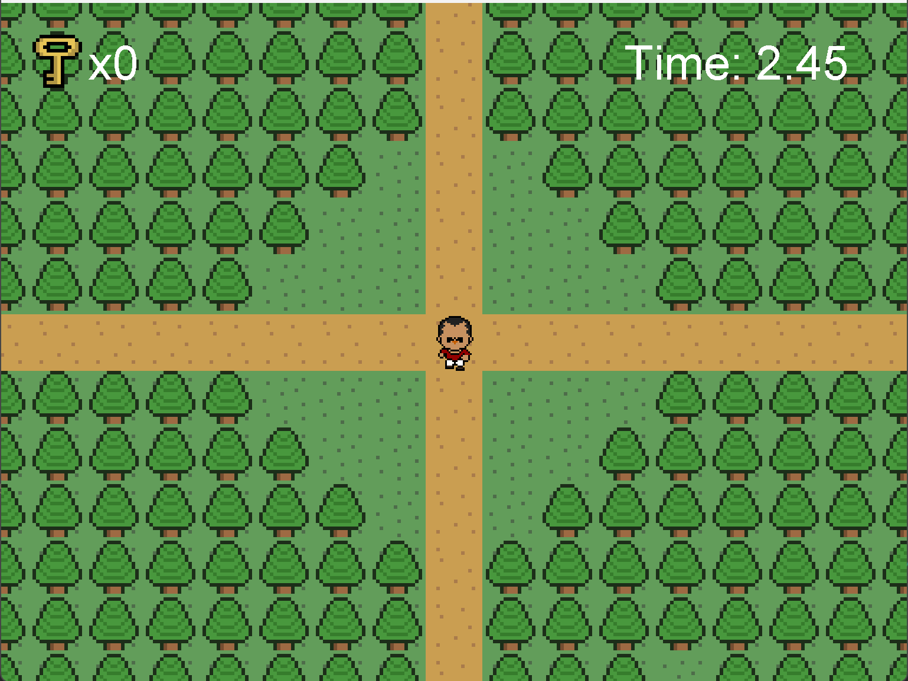
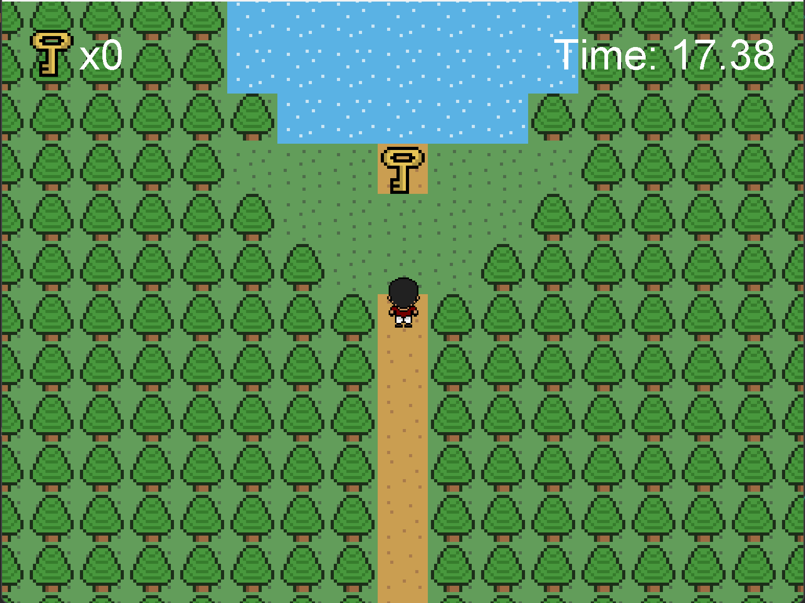
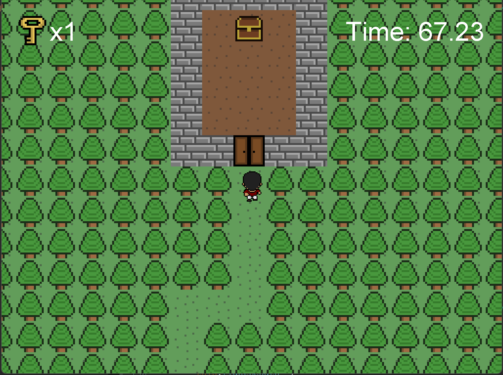

# Java Treasure Hunt Game

This game features a fully animated character on a 2D plane. The game is complete with sound effects for when the player interacts with their enviroment, as well as a backing track that will play thoughout the game play. The objective of the game is to obtain three keys in order to open three gates which lead to the final treasure. The game also features a game clock so that players can compete for the fastest time.

This is how the game begins:

Example location of a key:

The room where the treasure is located:

